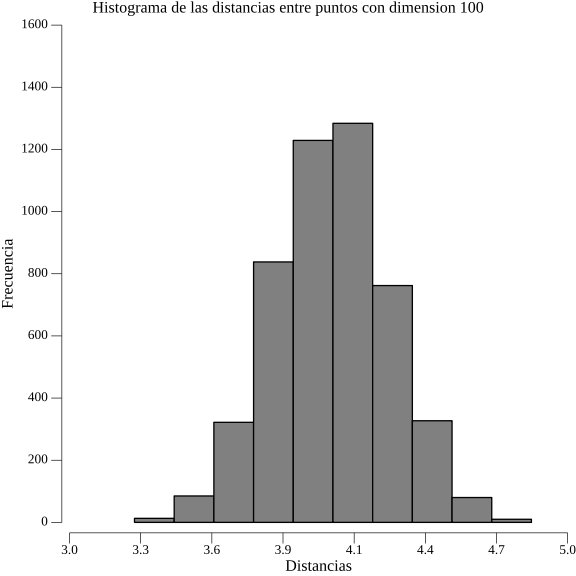

# The Curse of Dimensionality

Credits by @ShinjiMC

In this experiment, we explore the "Curse of Dimensionality" by generating random data sets of various dimensions and calculating the Euclidean distances between points in those data sets. We also create histograms of the distances using Go and the Gonum/plot library.

- Generate 100 random points between 0 and 1 of dimension n.
- Calculate the Euclidean distance between all pairs of points.
- Generate a histogram of the distances.
## How its works?
To run the program, simply execute the `main.exe` file.

### Data Generation in C++
In C++ `main.cpp`, we generate a comprehensive list of data points and their corresponding distances as double values. This results in a total of 4950 distances. These distances are then written to a text file.

### Data Visualization with Go and Gonum/plot
The next step involves using Go `Histogram/Histogram.go`, along with the Gonum/plot library, to process the text file generated earlier. The Go program reads the text file, extracts all the distances as float64 values, and utilizes this data to create a histogram in image format.

### Histogram Visualization
The generated histogram images visually represent the distribution of distances in the dataset, providing valuable insights into the "Curse of Dimensionality."

## Examples 
### Dimension 2

### Dimension 10

### Dimension 50

### Dimension 100

### Dimension 500

### Dimension 1000

### Dimension 2000

### Dimension 5000

